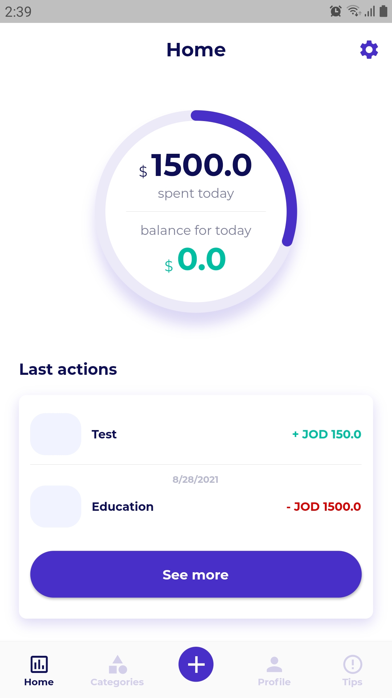
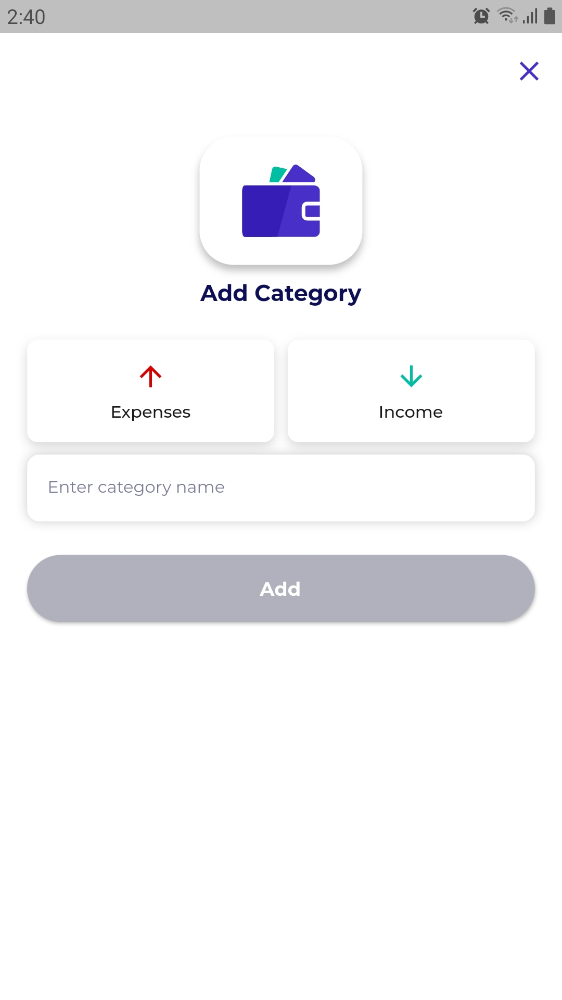
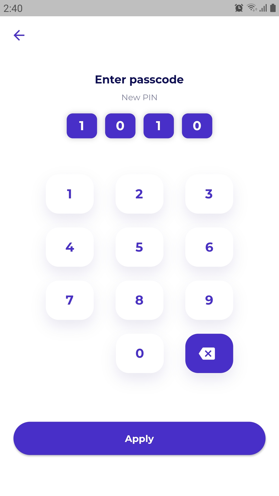
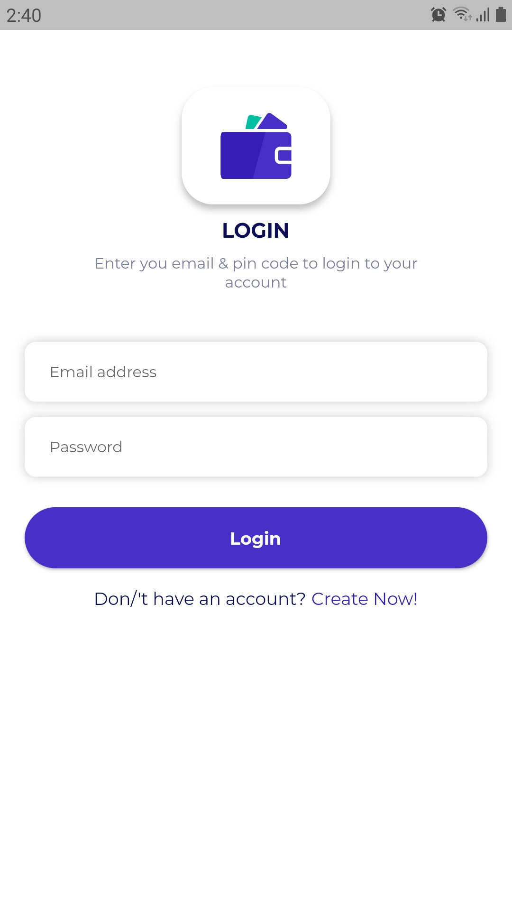
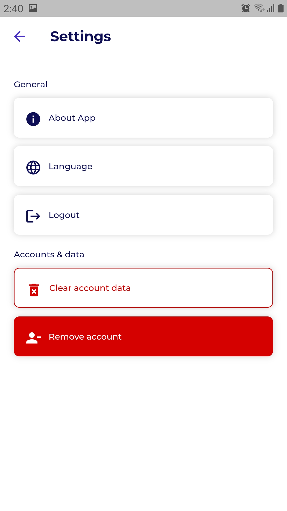
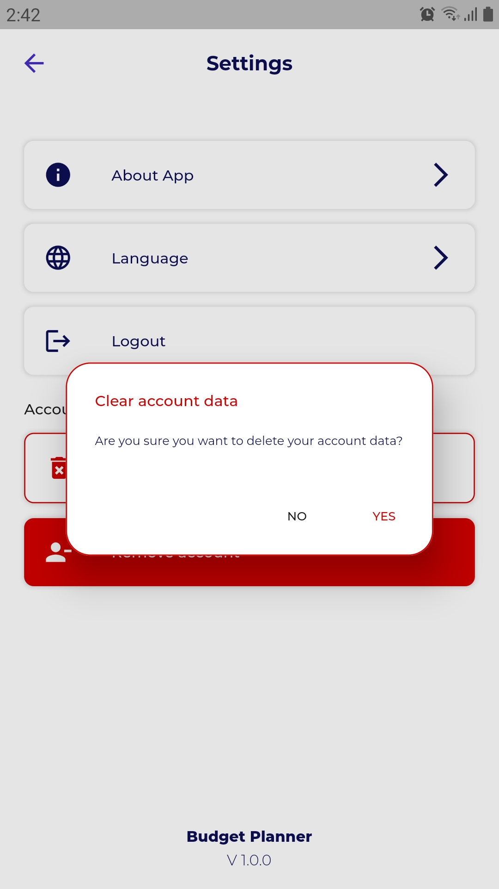
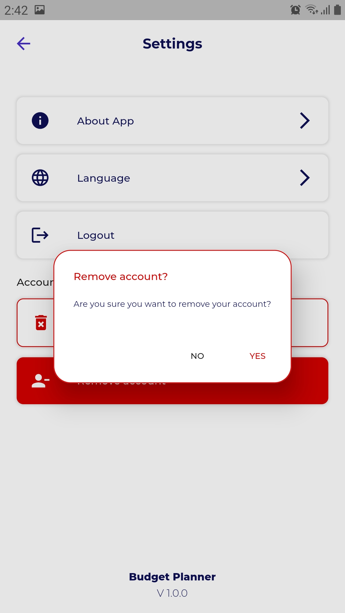

# Budget Planner 💰

A clean and efficient personal finance management app built with **Flutter**. It allows users to track their income and expenses, providing a clear overview of their financial health.

## ✨ Key Features
- **Offline Storage:** Uses **SQLite** to store data locally, ensuring privacy and speed.
- **Security:** Built-in passcode protection to keep financial data secure.
- **Smart Tracking:** Easily log income and expenses with categorized entries.
- **Multi-language Support:** Fully localized using Flutter's **Localization** package.
- **Reactive UI:** Smooth state management and navigation powered by **GetX**.

## 🛠️ Tech Stack
- **Framework:** Flutter (Dart)
- **Database:** SQLite (sqflite)
- **State Management:** GetX
- **Localization:** Flutter Internationalization

---

## 📸 Screenshots

| 
Main Dashboard
 | 
Add Category
 | 
Passcode
 |
|:---:|:---:|:---:|
|  |  |  |

  
<b>🔍 View More (4 More Screens)</b>

  

    
    
    
    
  

---

## 🛠️ Installation
1. Clone the repository.
2. Run `flutter pub get`.
3. Build and run on your device.
